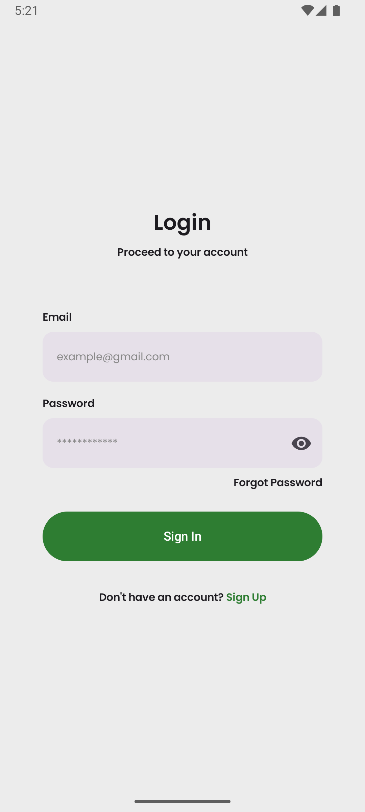
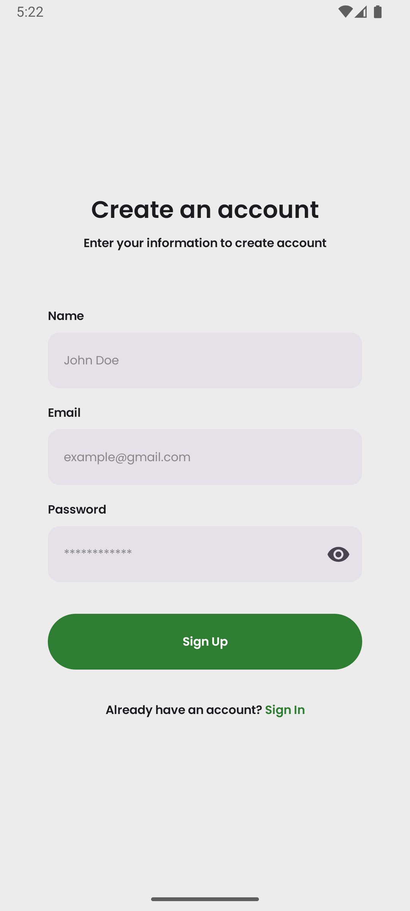
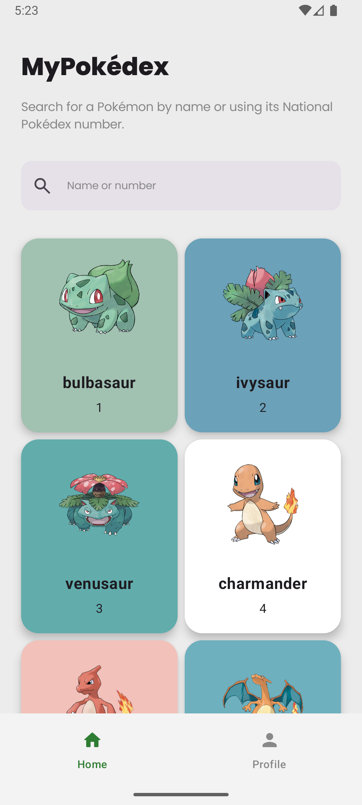
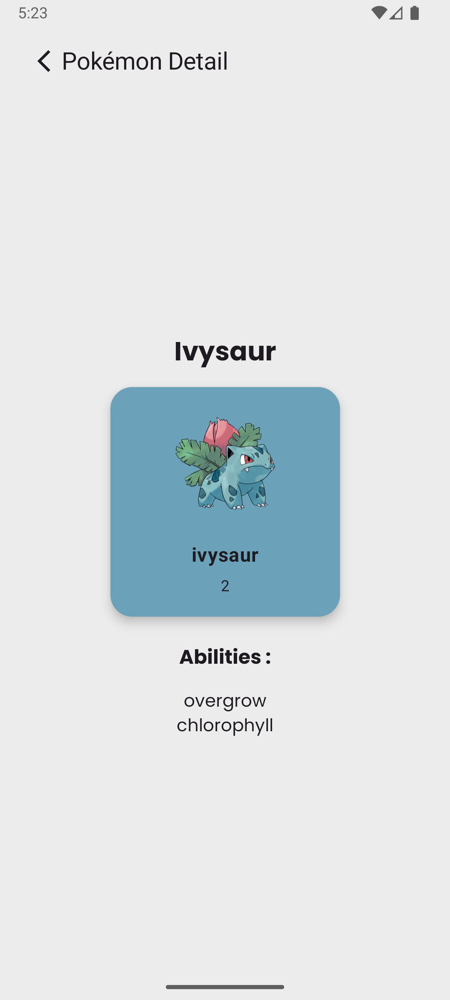

# MyPokedex 🐱‍👤

MyPokedex adalah aplikasi Android yang menampilkan daftar Pokémon menggunakan **PokeAPI**.  
Aplikasi ini dibangun menggunakan **Modern Android Development** dengan **Clean Architecture** dan **Multi Module Architecture**.

---

# App Preview

| Login | Register | Home |
|------|------|------|
|  |  |  |

| Detail | Profile |
|------|------|
|  |  |

---

# Tech Stack

## Language
- Kotlin

## UI
- Jetpack Compose

## Architecture
- Clean Architecture
- Multi Module Architecture
- MVVM

## Libraries
- Hilt (Dependency Injection)
- Retrofit (Network Request)
- OkHttp (HTTP Client)
- Room (Local Database)
- Paging 3 (Pagination)
- Coil (Image Loading)
- Kotlin Coroutines
- Kotlin Flow

